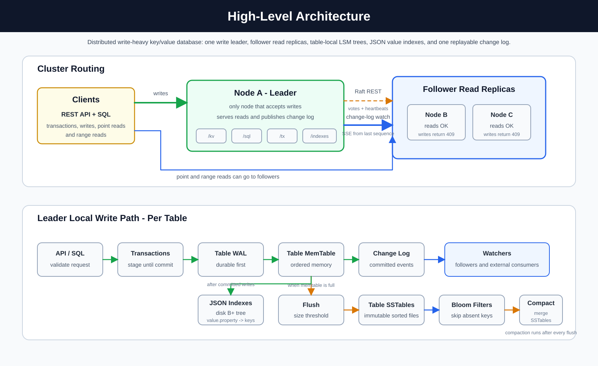
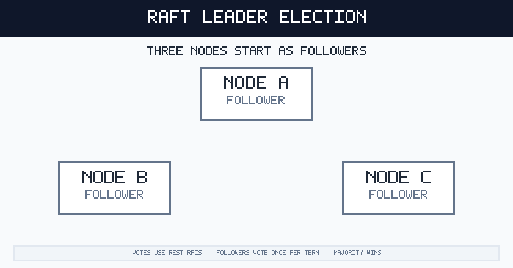
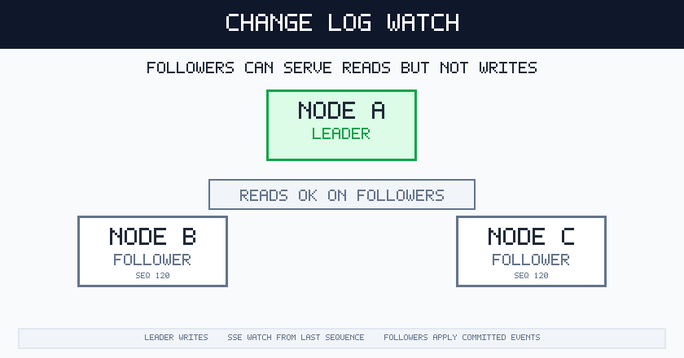
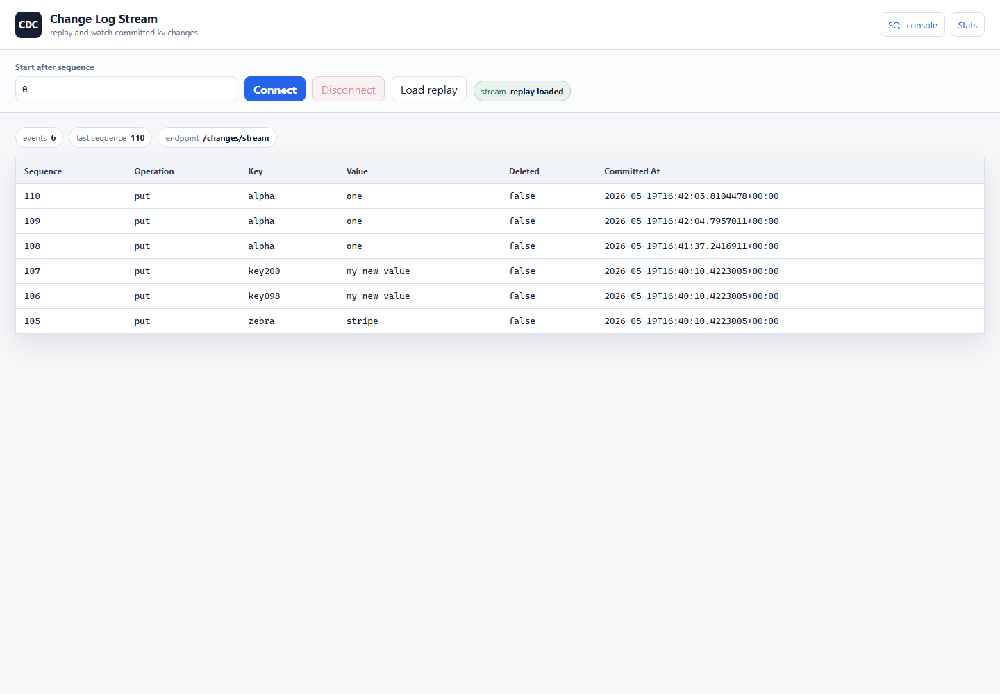

# Simple Distibuted LSM-based Write Heavy Database

This project is database backed by a write-optimized key/value store.

## Goals

- Optimize for frequent writes.
- Support point reads and range reads.
- Support multiple logical tables, each with its own WAL, memtable, SSTables,
  Bloom filters, and compaction lifecycle.
- Use Bloom filters to skip SSTables that definitely do not contain a key.
- Support explicit transactions with begin, staged writes, commit, and rollback.
- Keep uncommitted transaction changes out of durable storage after a server crash.
- Provide a modular SQL engine over the existing key/value and transaction APIs.
- Support SQL table creation, point reads, range reads, inserts, updates,
  deletes, and transaction control.
- Publish committed change-log events so replicas and external consumers can
  replay changes or subscribe over Server-Sent Events from a known sequence
  number.
- Elect one write leader with Raft-style terms, votes, and heartbeats while
  allowing followers to serve reads and replicate from the leader's change log.
- Flush in-memory data to disk when a size threshold is reached.
- Run compaction immediately after every flush.

## High-Level Architecture



## Data Model

The database stores named tables. Each table is an independent key/value LSM
tree with string keys and string values.

Deletes are represented as tombstones so inserts, updates, and deletes can all
move through the same write path inside that table.

Keys are ordered using ordinal string comparison. Range queries use that same
ordering.

The default table is named `kv`, and the old `/kv` endpoints still target that
default table. Additional tables are created explicitly and live under their own
storage directories.

The SQL layer exposes every table with the same two logical columns: `key` and
`value`.

### SQL Engine

The SQL engine lives under `Sql/` and is intentionally layered above the
key/value database. It does not read or write WAL files, memtables, or SSTables
directly. Instead, it parses SQL into a small statement model and executes those
statements through the same `LsmStore` and `TransactionManager` methods used by
the REST API.

The main pieces are:

- `SqlParser`: tokenizes and parses supported SQL text into statement objects.
- `SqlEngine`: validates and executes parsed statements against `LsmStore` or
  `TransactionManager`.
- `SqlEndpoints`: exposes `POST /sql` and converts parser/execution errors into
  HTTP responses.

The SQL layer currently maps every database table to the same logical shape:

```sql
table_name(key string, value string)
```

This means SQL is a user-facing query language for the existing key/value store,
not a separate storage engine or a full relational schema system.

Submit SQL with:

```json
{
  "query": "SELECT key, value FROM users WHERE key = 'user:1001'",
  "transactionId": null
}
```

Supported statements:

- `CREATE TABLE users`
- `CREATE TABLE IF NOT EXISTS users`
- `BEGIN` or `BEGIN TRANSACTION`
- `COMMIT` or `COMMIT TRANSACTION`
- `ROLLBACK` or `ROLLBACK TRANSACTION`
- `INSERT INTO users (key, value) VALUES ('user:1001', 'Ada')`
- `INSERT INTO users VALUES ('user:1001', 'Ada')`
- `SELECT * FROM users WHERE key = 'user:1001'`
- `SELECT key, value FROM users WHERE key BETWEEN 'user:1000' AND 'user:1999' LIMIT 100`
- `SELECT key FROM users WHERE key >= 'user:1000' AND key <= 'user:1999'`
- `UPDATE users SET value = 'updated' WHERE key = 'user:1001'`
- `DELETE FROM users WHERE key = 'user:1001'`

`BEGIN` returns a transaction id. Include that id in later `/sql` requests to
stage SQL writes in the transaction or read with staged changes overlaid on
committed data. `COMMIT` and `ROLLBACK` require the transaction id in the
request body.

Example transaction flow:

```json
{ "query": "BEGIN", "transactionId": null }
```

Then use the returned transaction id:

```json
{
  "query": "INSERT INTO users (key, value) VALUES ('user:1001', '{\"name\":\"Ada\",\"tier\":\"gold\"}')",
  "transactionId": "00000000-0000-0000-0000-000000000000"
}
```

A more complex read can project selected columns, scan a key range, and limit
the result:

```json
{
  "query": "SELECT key, value FROM users WHERE key >= 'user:1000' AND key <= 'user:1999' LIMIT 50",
  "transactionId": "00000000-0000-0000-0000-000000000000"
}
```

That range query is translated to the same bounded key scan used by
`GET /kv/range`, then the SQL engine overlays any staged writes or deletes from
the transaction before applying the projection and limit.

This is not a full relational SQL database. Tables do not define custom columns
yet, and there are no joins, secondary indexes, or arbitrary predicates; SQL is
currently another way to call the existing table/key/value operations.

## HTTP API

- `GET /tables`: list tables.
- `PUT /tables/{table}`: create a table.
- `PUT /tables/{table}/kv/{key}`: create or update a value in a table.
- `GET /tables/{table}/kv/{key}`: fetch a single value from a table.
- `DELETE /tables/{table}/kv/{key}`: delete a key from a table.
- `GET /tables/{table}/kv/range?start=a&end=z&limit=100`: return table keys
  in sorted order.
- `GET /tables/{table}/stats`: inspect one table.
- `PUT /kv/{key}`: create or update a value in the default `kv` table.
- `GET /kv/{key}`: fetch a single value from the default `kv` table.
- `DELETE /kv/{key}`: delete a key from the default `kv` table.
- `GET /kv/range?start=a&end=z&limit=100`: return default table keys in
  sorted order.
- `POST /transactions`: start a transaction.
- `PUT /transactions/{transactionId}/kv/{key}`: stage a transactional upsert.
- `DELETE /transactions/{transactionId}/kv/{key}`: stage a transactional delete.
- `GET /transactions/{transactionId}/kv/{key}`: read with the transaction's
  staged changes overlaid on committed data.
- `GET /transactions/{transactionId}/kv/range?start=a&end=z&limit=100`: range
  read with staged transaction changes overlaid on committed data.
- `PUT /transactions/{transactionId}/tables/{table}/kv/{key}`: stage a
  transactional upsert in a table.
- `DELETE /transactions/{transactionId}/tables/{table}/kv/{key}`: stage a
  transactional delete in a table.
- `GET /transactions/{transactionId}/tables/{table}/kv/{key}`: read a table
  with the transaction's staged changes overlaid on committed data.
- `GET /transactions/{transactionId}/tables/{table}/kv/range?start=a&end=z&limit=100`:
  range read a table with staged transaction changes overlaid on committed data.
- `POST /transactions/{transactionId}/commit`: commit staged writes.
- `DELETE /transactions/{transactionId}`: rollback and discard staged writes.
- `POST /sql`: execute a SQL statement against the table/key/value model.
- `GET /sql-console`: open the embedded browser SQL console.
- `GET /changes?fromSequence=0&limit=100`: replay committed change-log events.
- `GET /changes/stream?fromSequence=0`: stream committed changes as
  Server-Sent Events.
- `GET /changes-console`: open the embedded change-log stream console.
- `GET /raft/state`: inspect this node's Raft role, term, leader, and applied
  change sequence.
- `POST /raft/request-vote`: internal Raft vote RPC used by peers.
- `POST /raft/append-entries`: internal Raft heartbeat RPC used by the leader.
- `GET /stats`: inspect database and per-table statistics.

## Components

### Write-Ahead Log

Every write is appended to a write-ahead log before it is applied to memory.
On startup, the log is replayed so acknowledged writes are not lost.

The log is reset after the current memtable is flushed to disk.

Each table has its own WAL under `data/tables/{table}/wal.log`. Direct `PUT`
and `DELETE` requests are written to that table's log as individual records.
Committed transaction writes are grouped by table and written as committed batch
records in the affected table WALs. On startup, each table replays individual
records and complete committed batches. A partial trailing batch line can be
left by a crash and is ignored instead of being replayed.

### Change Log Stream

Committed writes from all tables are also appended to `data/changelog.log` as
change-log events. Each event contains the global committed sequence number,
table, operation, key, value, tombstone flag, and commit timestamp. Direct
`PUT`/`DELETE`, SQL writes, and transaction commits all publish through the same
log because they all eventually call the storage engine write path.

Consumers can replay recent changes with:

```text
GET /changes?fromSequence=120&limit=100
```

They can also subscribe to the live stream with:

```text
GET /changes/stream?fromSequence=120
```

The stream uses Server-Sent Events. The server first replays durable changelog
entries with `Sequence > fromSequence`, then keeps the HTTP response open and
sends new committed events as they happen. This lets another service store the
last sequence it processed and reconnect later without reprocessing older
changes.

Example event:

```text
id: 121
event: change
data: {"sequence":121,"operation":"put","key":"user:1001","value":"Ada","isDeleted":false,"committedAt":"2026-05-19T12:00:00Z","table":"users"}
```

The browser UI at `/changes-console` can replay or subscribe to the same stream
and display events in a table.

### Raft Leader Election

The Raft layer lives under `Raft/` and is responsible for leader election,
heartbeats, write gating, and follower replication. It is intentionally separate
from the storage engine.

Leader election:



Change-log subscription:



Each node has a role:

- Leader: accepts writes, appends them to the WAL and change log, and sends
  heartbeats to peers.
- Follower: rejects write requests with a `409 Conflict`, keeps serving reads,
  and subscribes to the leader's `/changes/stream` endpoint to apply committed
  changes locally.
- Candidate: starts an election when it has not seen a heartbeat within the
  election timeout.

The election protocol tracks terms and votes in `data/raft-state.json`.
Followers vote at most once per term. The elected leader sends heartbeat
messages through `/raft/append-entries`; if a node sees a newer term, it steps
down to follower.

Follower replication uses the durable change-log stream rather than exposing
SSTables directly. Each follower stores the last leader change sequence it
applied in `data/raft-replication.json`, then reconnects with:

```text
GET {leaderUrl}/changes/stream?fromSequence={lastAppliedChangeSequence}
```

The follower first receives missed durable events and then continues with live
events. Applied changes preserve the leader's change sequence locally so the
replica can resume from the same sequence after restart. Change-log events carry
the table name, so followers create missing tables and apply each event to the
matching table-local LSM tree.

Writes are gated at the API layer. Direct `PUT`/`DELETE`, transactional writes,
transaction commits, SQL writes, and SQL transaction control require the node to
be the current leader. Point and range reads remain available on followers.

Example three-node configuration for one node:

```json
{
  "Raft": {
    "Enabled": true,
    "NodeId": "node-a",
    "PublicUrl": "http://localhost:8081",
    "Peers": [
      { "NodeId": "node-b", "Url": "http://localhost:8082" },
      { "NodeId": "node-c", "Url": "http://localhost:8083" }
    ]
  }
}
```

### Transactions

Transactions live in the `Transactions/` code path and stage writes in memory.
Starting a transaction returns a transaction id. `PUT` and `DELETE` requests made
through that id update only the transaction's private table/key write set; they
are not written to any table WAL, are not applied to any memtable, and are not
visible to normal reads.

Reads inside a transaction see their own staged writes overlaid on top of the
committed table. A staged delete hides the committed value for that table/key
inside the transaction.

Conflict detection is not implemented yet. If two transactions write the same
table/key, commits are serialized through the target table store mutex and the
later commit wins because it receives the newer global sequence number. Reads
for table/keys that were not staged in the transaction can also see changes
committed by other transactions after this transaction started.

Commit closes the transaction and sends its staged operations to the storage
engine. Operations are grouped by table, and each affected table appends its
committed batch to its own WAL before applying the records to its memtable, so a
restart can replay complete committed batches. Rollback simply discards the
in-memory write set.

If the server crashes before commit finishes writing a complete committed batch,
the transaction's staged writes are not restored on startup. This keeps
uncommitted changes from becoming durable.

#### ACID Properties

- Atomicity: transaction writes are staged in memory and become visible only
  when commit sends the full staged write set to the store as one batch. Rollback
  drops the staged write set.
- Consistency: committed records still go through the same key/value validation,
  table validation, sequence numbering, tombstone handling, WAL, memtable,
  flush, and compaction rules as direct writes.
- Isolation: uncommitted writes are private to their transaction, and a
  transaction reads its own staged writes. This is not snapshot or serializable
  isolation: reads for keys not staged in the transaction can see newer commits
  from other transactions, and conflicting writes use last commit wins.
- Durability: commit appends each table's committed batch to that table's WAL
  before applying it to the memtable. After a restart, complete committed
  batches are replayed. Partial trailing batch records are ignored, so
  incomplete commits do not become durable.

### SQL Console

The service also serves a browser-based SQL console at `/sql-console`. It is
implemented in `SqlConsole/` and ships with the API, so there is no separate
frontend build step. The page posts queries to `/sql`, renders returned rows as a
table, stores recent queries in browser local storage, and keeps the active
transaction id in the console input.


The console has direct controls for `BEGIN`, `COMMIT`, and `ROLLBACK`. When
`BEGIN` returns a transaction id, the console stores it and sends it with later
queries until the transaction is committed, rolled back, or cleared. The sidebar
also includes clickable suggested queries for point reads, range reads, writes,
and transaction control.

### Change Log Console

The service also serves `/changes-console`, a browser page for replaying and
watching committed change-log events. Enter the last processed sequence, connect
to the stream, and the page shows replayed and live events in a table. It uses
`/changes/stream` for live updates and `/changes` for one-time replay.



### Ordered MemTable

Each database table has its own memtable. The memtable must support sorted
iteration, so it is not a hash dictionary. It is an ordered in-memory table
keyed by string.

For this simple C# version, the implementation can wrap a `SortedDictionary`
because .NET's `SortedDictionary` is a tree-backed ordered map, not a hash table.
The rest of the code should depend on a small `MemTable` abstraction so the
internal structure can later be replaced with a skip list or B-tree without
changing the API or storage engine.

The memtable supports:

- single-key lookup,
- insert/update/delete by key,
- sorted range scans from `start` to `end`,
- snapshotting sorted records during flush.

### SSTables

Each table flush creates one immutable sorted string table on disk under that
table's `sstables/` directory.
Records are written in key order, which makes range queries possible without
loading the whole database into memory.

Each SSTable has a companion Bloom filter sidecar file. Point reads check the
Bloom filter before opening the data file, which avoids unnecessary file reads
for keys that are definitely absent.

Without compaction, every flush would leave another SSTable behind for that
table. A point read that misses the table memtable would then check that table's
SSTables from newest to oldest, because newer SSTables contain newer writes for
the same key. The first matching non-deleted record is the value to return.

In this project, compaction runs immediately after every flush. That means the
normal state after compaction is one compacted SSTable plus the active memtable,
not many SSTables. The newest-to-oldest read path still works if multiple
SSTables exist temporarily before compaction, or if the compaction strategy is
changed later.

SSTable data is still stored as JSON so the implementation stays easy to inspect.
That also means this simple version reads the matching SSTable file after the
Bloom filter says the key might exist. For very large SSTables, a production
engine would add an SSTable index and block-based file format so point reads can
seek to the relevant block instead of scanning the whole file.

**TODO: replace full-file SSTable reads.** Add an SSTable index and block-based
storage format so point reads can use the Bloom filter, seek to a small key
range, and read only the relevant block instead of deserializing a whole SSTable.

### Compaction

Compaction runs immediately after each flush.

The compactor reads all SSTables, keeps only the newest record for each key,
drops tombstoned keys, and writes one compacted SSTable. The old SSTables are
then removed.

This keeps read and range-query amplification low while avoiding a full leveled
LSM implementation.

## Write Path

1. API or SQL receives a `PUT`, `INSERT`, `UPDATE`, or `DELETE` for a table.
2. The database routes the operation to that table's LSM store.
3. The table store appends the operation to that table's write-ahead log.
4. The table store applies the operation to that table's ordered memtable.
5. The global change log records the committed table/key event.
6. If the table memtable reaches the flush threshold:
   - write that table's memtable as a new SSTable,
   - clear that table's write-ahead log,
   - compact that table's SSTables into one SSTable.

## Point Read Path

1. Route the read to the requested table.
2. Check that table's memtable first.
3. If the key is tombstoned, return not found.
4. If not found in memory, scan that table's SSTables from newest to oldest.
5. Use each SSTable's Bloom filter to skip files that definitely do not contain
   the key.
6. Return the newest non-tombstoned value, or not found.

## Range Read Path

1. Route the range read to the requested table.
2. Read the sorted table memtable range.
3. Read matching sorted ranges from that table's SSTables.
4. Merge records by key.
5. Keep the newest sequence number for each key.
6. Drop tombstoned keys.
7. Return up to `limit` records in sorted key order.

Because compaction runs after every flush, the usual case for each table is one
SSTable plus that table's active memtable.

## Storage Layout

Runtime data lives under `data/`:

- `data/catalog.json`: table catalog.
- `data/changelog.log`: committed change-log events for replayable subscriptions.
- `data/raft-state.json`: persisted Raft term and vote.
- `data/raft-replication.json`: last leader change sequence applied by a
  follower.
- `data/tables/{table}/wal.log`: pending direct writes and committed transaction
  batches for one table that are not yet flushed.
- `data/tables/{table}/sstables/*.json`: immutable sorted tables for one table.
- `data/tables/{table}/sstables/*.bloom.json`: Bloom filter sidecars for that
  table's SSTables.

## Testing

Unit tests live under `tests/LsmWriteDb.Tests`.

Run them with:

```bash
dotnet test .\tests\LsmWriteDb.Tests\LsmWriteDb.Tests.csproj
```

## Docker

Build the image:

```bash
docker build -t heavy-write-db .
```

Run the container:

```bash
docker run --rm -p 8080:8080 heavy-write-db
```

Run a local three-node Raft cluster:

```bash
docker compose up --build
```

The compose cluster exposes:

- `node-a` on `http://localhost:8081`
- `node-b` on `http://localhost:8082`
- `node-c` on `http://localhost:8083`

Each container advertises its internal Docker DNS URL, such as
`http://node-a:8080`, so Raft vote and heartbeat RPCs stay inside the compose
network. Use `/raft/state` on each host port to see which node is leader.

## Non-Goals

- No full relational SQL layer with schemas, joins, secondary indexes, or
  arbitrary predicates.
- No dynamic Raft membership changes.
- No full Raft log replication; followers replicate committed storage changes
  from the leader's durable change log after leader election.
- No background compaction.
- No custom binary SSTable format.
- No configurable isolation levels beyond read-your-own-writes inside a
  transaction and serialized commit through the affected table store mutex.

Those can be added later, but they would make the first version harder to read.
