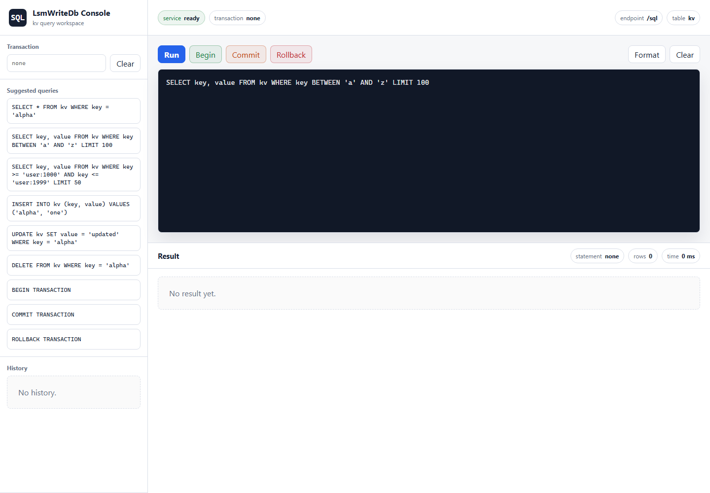

# Simple LSM-based Heavy Write Database

This project is a small C# REST API backed by a write-optimized key/value store.

## Goals

- Optimize for frequent writes.
- Support point reads and range reads.
- Use Bloom filters to skip SSTables that definitely do not contain a key.
- Support explicit transactions with begin, staged writes, commit, and rollback.
- Keep uncommitted transaction changes out of durable storage after a server crash.
- Provide a modular SQL engine over the existing key/value and transaction APIs.
- Support SQL point reads, range reads, inserts, updates, deletes, and
  transaction control for the logical `kv` table.
- Serve a built-in browser SQL console with query history, transaction controls,
  and tabular results.
- Flush in-memory data to disk when a size threshold is reached.
- Run compaction immediately after every flush.

## Data Model

The database stores string keys and string values.

Deletes are represented as tombstones so inserts, updates, and deletes can all
move through the same write path.

Keys are ordered using ordinal string comparison. Range queries use that same
ordering.

The SQL layer exposes this same model as one logical table named `kv` with two
string columns: `key` and `value`.

## HTTP API

- `PUT /kv/{key}`: create or update a value.
- `GET /kv/{key}`: fetch a single value.
- `DELETE /kv/{key}`: delete a key.
- `GET /kv/range?start=a&end=z&limit=100`: return keys in sorted order.
- `POST /transactions`: start a transaction.
- `PUT /transactions/{transactionId}/kv/{key}`: stage a transactional upsert.
- `DELETE /transactions/{transactionId}/kv/{key}`: stage a transactional delete.
- `GET /transactions/{transactionId}/kv/{key}`: read with the transaction's
  staged changes overlaid on committed data.
- `GET /transactions/{transactionId}/kv/range?start=a&end=z&limit=100`: range
  read with staged transaction changes overlaid on committed data.
- `POST /transactions/{transactionId}/commit`: commit staged writes.
- `DELETE /transactions/{transactionId}`: rollback and discard staged writes.
- `POST /sql`: execute a SQL statement against the logical `kv` table.
- `GET /sql-console`: open the embedded browser SQL console.
- `GET /stats`: inspect simple store statistics.

## Components

### Write-Ahead Log

Every write is appended to a write-ahead log before it is applied to memory.
On startup, the log is replayed so acknowledged writes are not lost.

The log is reset after the current memtable is flushed to disk.

Direct `PUT` and `DELETE` requests are written to the log as individual records.
Committed transactions are written as one committed batch record. On startup, the
store replays individual records and complete committed batches. A partial
trailing batch line can be left by a crash and is ignored instead of being
replayed.

### Transactions

Transactions live in the `Transactions/` code path and stage writes in memory.
Starting a transaction returns a transaction id. `PUT` and `DELETE` requests made
through that id update only the transaction's private write set; they are not
written to the WAL, are not applied to the memtable, and are not visible to
normal `/kv` reads.

Reads inside a transaction see their own staged writes overlaid on top of the
committed store. A staged delete hides the committed value for that key inside
the transaction.

Conflict detection is not implemented yet. If two transactions write the same
key, commits are serialized through the store mutex and the later commit wins
because it receives the newer sequence number. Reads for keys that were not
staged in the transaction can also see changes committed by other transactions
after this transaction started.

Commit closes the transaction and sends its staged operations to the storage
engine as one batch. The storage engine appends that committed batch to the WAL
before applying the records to the memtable, so a restart can replay the full
committed batch. Rollback simply discards the in-memory write set.

If the server crashes before commit finishes writing a complete committed batch,
the transaction's staged writes are not restored on startup. This keeps
uncommitted changes from becoming durable.

#### ACID Properties

- Atomicity: transaction writes are staged in memory and become visible only
  when commit sends the full staged write set to the store as one batch. Rollback
  drops the staged write set.
- Consistency: committed records still go through the same key/value validation,
  sequence numbering, tombstone handling, WAL, memtable, flush, and compaction
  rules as direct writes.
- Isolation: uncommitted writes are private to their transaction, and a
  transaction reads its own staged writes. This is not snapshot or serializable
  isolation: reads for keys not staged in the transaction can see newer commits
  from other transactions, and conflicting writes use last commit wins.
- Durability: commit appends the committed batch to the WAL before applying it to
  the memtable. After a restart, complete committed batches are replayed. Partial
  trailing batch records are ignored, so incomplete commits do not become
  durable.

### SQL Engine

The SQL engine lives under `Sql/` and is intentionally layered above the
key/value database. It does not read or write WAL files, memtables, or SSTables
directly. Instead, it parses SQL into a small statement model and executes those
statements through the same `LsmStore` and `TransactionManager` methods used by
the REST API.

The main pieces are:

- `SqlParser`: tokenizes and parses supported SQL text into statement objects.
- `SqlEngine`: validates and executes parsed statements against `LsmStore` or
  `TransactionManager`.
- `SqlEndpoints`: exposes `POST /sql` and converts parser/execution errors into
  HTTP responses.

The SQL layer currently maps the database to one logical table:

```sql
kv(key string, value string)
```

This means SQL is a user-facing query language for the existing key/value store,
not a separate storage engine.

Submit SQL with:

```json
{
  "query": "SELECT key, value FROM kv WHERE key = 'alpha'",
  "transactionId": null
}
```

Supported statements:

- `BEGIN` or `BEGIN TRANSACTION`
- `COMMIT` or `COMMIT TRANSACTION`
- `ROLLBACK` or `ROLLBACK TRANSACTION`
- `INSERT INTO kv (key, value) VALUES ('alpha', 'one')`
- `INSERT INTO kv VALUES ('alpha', 'one')`
- `SELECT * FROM kv WHERE key = 'alpha'`
- `SELECT key, value FROM kv WHERE key BETWEEN 'a' AND 'z' LIMIT 100`
- `SELECT key FROM kv WHERE key >= 'a' AND key <= 'z'`
- `UPDATE kv SET value = 'updated' WHERE key = 'alpha'`
- `DELETE FROM kv WHERE key = 'alpha'`

`BEGIN` returns a transaction id. Include that id in later `/sql` requests to
stage SQL writes in the transaction or read with staged changes overlaid on
committed data. `COMMIT` and `ROLLBACK` require the transaction id in the
request body.

Example transaction flow:

```json
{ "query": "BEGIN", "transactionId": null }
```

Then use the returned transaction id:

```json
{
  "query": "INSERT INTO kv (key, value) VALUES ('user:1001', '{\"name\":\"Ada\",\"tier\":\"gold\"}')",
  "transactionId": "00000000-0000-0000-0000-000000000000"
}
```

A more complex read can project selected columns, scan a key range, and limit
the result:

```json
{
  "query": "SELECT key, value FROM kv WHERE key >= 'user:1000' AND key <= 'user:1999' LIMIT 50",
  "transactionId": "00000000-0000-0000-0000-000000000000"
}
```

That range query is translated to the same bounded key scan used by
`GET /kv/range`, then the SQL engine overlays any staged writes or deletes from
the transaction before applying the projection and limit.

This is not a full relational SQL database. There is no schema catalog, joins,
secondary indexes, or arbitrary predicates yet; SQL is currently another way to
call the existing key/value operations.

### SQL Console

The service also serves a browser-based SQL console at `/sql-console`. It is
implemented in `SqlConsole/` and ships with the API, so there is no separate
frontend build step. The page posts queries to `/sql`, renders returned rows as a
table, stores recent queries in browser local storage, and keeps the active
transaction id in the console input.



The console has direct controls for `BEGIN`, `COMMIT`, and `ROLLBACK`. When
`BEGIN` returns a transaction id, the console stores it and sends it with later
queries until the transaction is committed, rolled back, or cleared. The sidebar
also includes clickable suggested queries for point reads, range reads, writes,
and transaction control.

### Ordered MemTable

The memtable must support sorted iteration, so it is not a hash dictionary.
It is an ordered in-memory table keyed by string.

For this simple C# version, the implementation can wrap a `SortedDictionary`
because .NET's `SortedDictionary` is a tree-backed ordered map, not a hash table.
The rest of the code should depend on a small `MemTable` abstraction so the
internal structure can later be replaced with a skip list or B-tree without
changing the API or storage engine.

The memtable supports:

- single-key lookup,
- insert/update/delete by key,
- sorted range scans from `start` to `end`,
- snapshotting sorted records during flush.

### SSTables

Each flush creates one immutable sorted string table on disk.
Records are written in key order, which makes range queries possible without
loading the whole database into memory.

Each SSTable has a companion Bloom filter sidecar file. Point reads check the
Bloom filter before opening the data file, which avoids unnecessary file reads
for keys that are definitely absent.

Without compaction, every flush would leave another SSTable behind. A point read
that misses the memtable would then check SSTables from newest to oldest, because
newer SSTables contain newer writes for the same key. The first matching
non-deleted record is the value to return.

In this project, compaction runs immediately after every flush. That means the
normal state after compaction is one compacted SSTable plus the active memtable,
not many SSTables. The newest-to-oldest read path still works if multiple
SSTables exist temporarily before compaction, or if the compaction strategy is
changed later.

SSTable data is still stored as JSON so the implementation stays easy to inspect.
That also means this simple version reads the matching SSTable file after the
Bloom filter says the key might exist. For very large SSTables, a production
engine would add an SSTable index and block-based file format so point reads can
seek to the relevant block instead of scanning the whole file.

**TODO: replace full-file SSTable reads.** Add an SSTable index and block-based
storage format so point reads can use the Bloom filter, seek to a small key
range, and read only the relevant block instead of deserializing a whole SSTable.

### Compaction

Compaction runs immediately after each flush.

The compactor reads all SSTables, keeps only the newest record for each key,
drops tombstoned keys, and writes one compacted SSTable. The old SSTables are
then removed.

This keeps read and range-query amplification low while avoiding a full leveled
LSM implementation.

## Write Path

1. API receives a `PUT` or `DELETE`.
2. Store appends the operation to the write-ahead log.
3. Store applies the operation to the ordered memtable.
4. If the memtable reaches the flush threshold:
   - write the memtable as a new SSTable,
   - clear the write-ahead log,
   - compact all SSTables into one SSTable.

## Point Read Path

1. Check the memtable first.
2. If the key is tombstoned, return not found.
3. If not found in memory, scan SSTables from newest to oldest.
4. Use each SSTable's Bloom filter to skip files that definitely do not contain
   the key.
5. Return the newest non-tombstoned value, or not found.

## Range Read Path

1. Read the sorted memtable range.
2. Read matching sorted ranges from SSTables.
3. Merge records by key.
4. Keep the newest sequence number for each key.
5. Drop tombstoned keys.
6. Return up to `limit` records in sorted key order.

Because compaction runs after every flush, the usual case is one SSTable plus the
active memtable.

## Storage Layout

Runtime data lives under `data/`:

- `data/wal.log`: pending direct writes and committed transaction batches not
  yet flushed.
- `data/sstables/*.json`: immutable sorted tables.
- `data/sstables/*.bloom.json`: Bloom filter sidecars for SSTables.

## Testing

Unit tests live under `tests/LsmWriteDb.Tests`.

Run them with:

```bash
dotnet test .\tests\LsmWriteDb.Tests\LsmWriteDb.Tests.csproj
```

## Docker

Build the image:

```bash
docker build -t heavy-write-db .
```

Run the container:

```bash
docker run --rm -p 8080:8080 heavy-write-db
```

## Non-Goals

- No full relational SQL layer with schemas, joins, secondary indexes, or
  arbitrary predicates.
- No replication.
- No background compaction.
- No custom binary SSTable format.
- No configurable isolation levels beyond read-your-own-writes inside a
  transaction and serialized commit through the store mutex.

Those can be added later, but they would make the first version harder to read.
