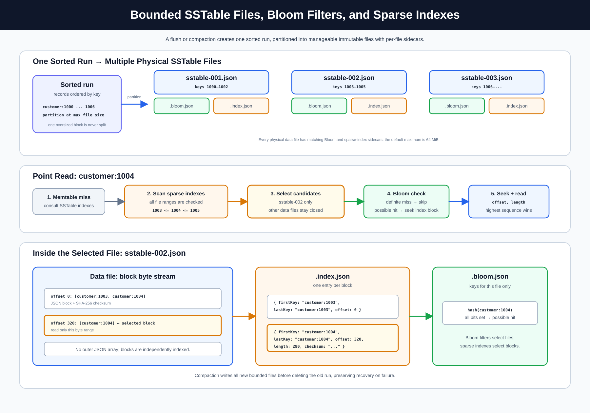

# Simple Distibuted LSM-based Write Heavy Database

This project is database backed by a write-optimized key/value store.

## Reading order


This document is organized from the distributed architecture down to the storage engine: topology and ownership come first, followed by transaction semantics, client APIs, internal components, read/write paths, and on-disk layout.


## Goals

- Optimize for frequent writes.
- Support point reads and range reads.
- Support multiple logical tables, each with its own WAL, memtable, SSTables,
  Bloom filters, and compaction lifecycle.
- Use Bloom filters to skip SSTables that definitely do not contain a key.
- Use configurable SSTable blocks with sparse indexes so point reads can seek
  to a small block instead of reading a whole SSTable.
- Support explicit local transactions and distributed transactions across table leaders using two-phase commit.
- Coordinate multi-table commits with a coordinator-driven prepare/commit/abort protocol and explicit `in-doubt` outcomes.
- Persist distributed transaction coordinator and participant state for restart recovery, idempotent phase retries, and automatic expiration cleanup.
- Expose distributed transaction status, recovery, structured logs, and phase metrics for operations.
- Use read-your-writes with read-committed visibility for transactions; conflicting writes use last-commit-wins semantics, with no snapshot or serializable isolation.
- Keep uncommitted transaction changes out of durable storage after a server crash.
- Provide a modular SQL engine over the existing key/value and transaction APIs.
- Support SQL table creation, point reads, key range reads, inserts, updates,
  deletes, transaction control, and equality filters over JSON `value`
  documents or dot-path properties.
- Enforce valid JSON documents for SQL `INSERT` and `UPDATE` values while
  keeping the lower-level key/value storage string-based.
- Support disk-backed B+ tree indexes over JSON `value` documents or dot-path
  properties for equality searches.
- Support inner equi-joins between tables on matching keys.
- Elect one leader per table with multiple followers and rebalance table ownership when replicas join or leave.
- Publish committed change-log events so replicas and external consumers can
  replay changes or subscribe over Server-Sent Events from a known sequence
  number.
- Run independent Raft elections per table, with one leader and multiple followers per table.
- Flush in-memory data to disk when a size threshold is reached.
- Run compaction immediately after every flush.

## Architecture

### High-level architecture


The cluster has independent leadership groups per table. A node may lead one
table while following another. The internal `__table_ownership` table records
which nodes currently own each table, the table term, leader URL, and rebalance
identifier.

### Low-level table flow


Writes first pass through the table-specific role guard. The table leader
appends to that table's WAL and memtable, then publishes a committed event.
Followers bootstrap with a table snapshot and continue from its sequence through
the SSE change stream. Each follower filters the shared change log by table.

### Supported architecture

- Independent Raft terms, votes, heartbeats, and elections per table.
- Multiple followers per table and different leaders for different tables.
- Table-specific write rejection with the current leader URL.
- Runtime peer registration through `POST /raft/membership/register`.
- Health-based automatic and explicit rebalancing through `POST /raft/rebalance`.
- Internal `__table_ownership` metadata storage, hidden from public table lists.
- Follower snapshot bootstrap through `GET /tables/{table}/snapshot`.
- Per-table applied sequence tracking and SSE reconnection.
- Table-local WALs and shared database change-log events.
- New tables are initially placed on the healthy node with the fewest user tables.
- Table-catalog creation is propagated to every configured peer before writes are accepted.
- Distributed transaction coordination uses two-phase commit across the affected table leaders.

## Per-Table Leadership

The cluster uses an independent Raft group for each logical table. A node can be
leader for `users` while following `orders`, allowing write load to be spread
across replicas. Each table leader accepts writes for that table; table
followers reject writes with the current table leader URL and replicate that
table's committed change stream.

Ownership records are stored in the internal `__table_ownership` table. The
record contains the table term, leader, members, and rebalance identifier. The
internal table is hidden from normal table listings and is bootstrapped with the
same table-leadership mechanism.

When a node joins or becomes unavailable, the ownership planner selects a new
member set and table leader. A table election requires a majority of that
table's members. A table without a majority becomes unavailable for writes to
avoid split-brain behavior. See [design/table-leadership.md](./design/table-leadership.md)
for the ownership, bootstrap, failure, and rebalancing protocol.

Distributed transactions use a coordinator-driven two-phase commit protocol across table leaders. Cross-table JOINs remain read-only.

### Table creation and load balancing

CREATE TABLE is cluster-wide. When the Router cannot discover an existing
leader for the requested table, it counts the user tables known by each healthy
node and sends the create request to the node with the fewest tables. That node
creates the local store and propagates the catalog entry to all configured
peers. Each peer initializes the table and its table-specific Raft state, so
the table exists on every replica before distributed writes use it.

If a peer is unavailable during creation, verify the table lists and monitoring
page before using the table in a distributed transaction. Clients should use a
Router URL rather than a database node URL.

## Router Process

Each database node can run with a companion `Router` process. The Router is an
HTTP reverse proxy that keeps pooled, long-lived connections to the database
nodes and routes requests to the current leader for the requested table.

The Router:

- Places new tables on the healthy node with the fewest user tables.

- Discovers a table leader through `/raft/tables/{table}/state`.
- Caches the leader URL per table to avoid discovery on every request.
- Forwards REST, SQL, and transaction requests while preserving method, headers,
  query string, and request body.
- Invalidates its cached leader after a leader-rejection or redirect and retries
  discovery once.
- Uses HTTP keep-alive/connection pooling and HTTP/2 connection support so the
  Router does not create a new TCP connection for every request.
- Falls back to its configured database node when no leader can be discovered.

Run it with:

```powershell
$env:ROUTER_DATABASE_URL = 'http://node-a:8080'
$env:ROUTER_PEERS = 'node-b=http://node-b:8080,node-c=http://node-c:8080'
dotnet run --project Router/Router.csproj --urls http://localhost:9080
```

Clients should connect to the Router port rather than selecting a table leader
manually. The Router forwards distributed transaction requests to a coordinator; the coordinator then contacts each affected table leader.
### Monitoring page

Open the Router monitoring page at `/monitoring` (for example, `http://localhost:9081/monitoring`). It refreshes every three seconds and displays:

- configured nodes and reachability;
- each discovered table;
- the role, term, and leader reported by every node for each table;
- ownership changes during elections and rebalancing.

The page uses `GET /monitoring/api/status` for its live JSON data. It is a Router-local operational view and does not change database state.
### SQL console through the Router

The Router exposes the same ergonomic SQL console as the database node. Open it through the Router instead of a database port:

```text
http://localhost:9081/sql-console
http://localhost:9082/sql-console
http://localhost:9083/sql-console
```

The Router serves the console page and its JavaScript/CSS assets, then forwards the console's `POST /sql` requests. It reads the table names from the SQL statement and sends each request to the current leader for the referenced table. The browser therefore stays connected to the Router while table leadership and replica ownership remain internal cluster details.
### Calling the database through the Router

When using Docker Compose, send requests to the Router port instead of the database port:

```text
Router A: http://localhost:9081
Router B: http://localhost:9082
Router C: http://localhost:9083
```

For example, create a table and write/read a value through Router A:

```powershell
curl.exe -X POST http://localhost:9081/tables/users
curl.exe -X PUT http://localhost:9081/kv/users/alice `
  -H "Content-Type: application/json" `
  -d '{"name":"Alice","active":true}'
curl.exe http://localhost:9081/kv/users/alice
```

The request can enter through any Router. This request sent to Router C is forwarded to whichever node is currently the leader of `users`:

```powershell
curl.exe -X PUT http://localhost:9083/kv/users/bob `
  -H "Content-Type: application/json" `
  -d '{"name":"Bob"}'
```

SQL is also sent to the Router. The Router identifies the table from the SQL statement and forwards the request to that table's leader:

```powershell
curl.exe -X POST http://localhost:9081/sql `
  -H "Content-Type: application/json" `
  -d '{"sql":"SELECT * FROM users"}'
```

Applications should use the Router URL as their database endpoint and do not need to know the current table leader. If a leader election changes ownership, the Router refreshes its cached route automatically. Database ports (`8080`) remain node-to-node and direct database endpoints; client traffic should normally use the Router ports.

## Distributed transactions
### Leader-only transaction writes

Transactional writes remain owned by their table leaders. A transaction ID must
be registered on every node so the leader of each target table can stage the
write. At COMMIT, the coordinator gathers staged operations from the participating
leaders and runs two-phase commit.

Routing all statements to the node that received BEGIN is not sufficient, because
that node may not lead every table in the transaction. The Router therefore
combines transaction registration, table-leader routing, and coordinator-side
operation collection. A transaction ID used on a node that did not create or
register it returns transaction not found. The Router removes registrations from
all nodes after COMMIT or ROLLBACK.

Distributed transactions are supported when one transaction writes to multiple tables. A coordinator groups the staged writes by table, discovers each table leader, runs the prepare phase on every participant, and sends commit only after every participant has acknowledged prepare. Each participant applies its batch through the normal WAL, memtable, index, and change-log path.


The client API is:

- `POST /distributed-transactions`: begin a distributed transaction.
- `PUT /distributed-transactions/{id}/writes`: stage `{ table, key, value, isDeleted }`.
- `POST /distributed-transactions/{id}/commit`: run 2PC and return `committed`, `aborted`, or `in-doubt`.
- `DELETE /distributed-transactions/{id}`: abort the coordinator transaction.
- `GET /distributed-transactions/{id}`: inspect durable transaction state.
- `POST /distributed-transactions/{id}/recover`: request recovery/status evaluation.
- `GET /distributed-transactions/metrics`: inspect 2PC phase counters and prepared/active counts.

A successful path is: discover all leaders → prepare every participant → commit every participant. If discovery, prepare, or a prepare timeout fails, already-prepared participants receive abort and no staged value becomes visible. If a failure occurs after prepare has succeeded, 2PC can enter an `in-doubt` state: the coordinator must recover the decision before participants can safely finish. Prepared state and coordinator decisions are journaled, idempotent phase retries are supported, and abandoned coordinator transactions are expired automatically. The complete protocol and failure matrix are documented in [design/distributed-transactions.md](./design/distributed-transactions.md).
### Transparent SQL promotion

SQL transactions keep the normal BEGIN, statement, and COMMIT contract. A one-table transaction uses the local path. When staged writes target tables whose leaders are on different nodes, COMMIT automatically promotes the write set to the distributed coordinator and runs 2PC. Multiple tables led by the same node remain a local commit. Applications do not need a separate distributed transaction API or special SQL syntax.

Example: BEGIN, insert into user, insert into account, then COMMIT. The coordinator discovers both table leaders, prepares both participants, and commits both batches.

### 2PC happy path


1. The Router sends the transaction request to a coordinator.
2. The coordinator groups writes by table and discovers each table leader.
3. It sends `prepare` to every participant. Participants journal the write set but do not expose it to reads.
4. After all prepare acknowledgements, the coordinator journals `committing`.
5. It sends `commit` to every participant. Each participant uses the normal WAL, memtable, index, and change-log path.
6. The coordinator returns `committed` only after all participants acknowledge.

### 2PC failure path and recovery


- Failure during leader discovery or prepare: already-prepared participants receive abort and the result is `aborted`.
- Failure after prepare: the coordinator returns `in-doubt`; prepared participants do not guess whether to commit or abort.
- Participant restart: its journal reloads prepared data and automatically replays journaled committing decisions.
- Repeated prepare or commit: requests are idempotent and return the existing decision.
- Abandoned active transactions: the background cleanup service expires them after one hour.
- Operational recovery: query `GET /distributed-transactions/{id}`, call `POST /distributed-transactions/{id}/recover`, and inspect `GET /distributed-transactions/metrics`.

The complete protocol, atomicity boundary, recovery model, and failure matrix are documented in [design/distributed-transactions.md](./design/distributed-transactions.md).

## Data Model

The database stores named tables. Each table is an independent key/value LSM
tree with string keys and string values. The SQL layer treats the `value`
column as JSON: SQL writes must provide valid JSON, and SQL reads can filter by
the full JSON value or by dot-path properties inside that value.

Deletes are represented as tombstones so inserts, updates, and deletes can all
move through the same write path inside that table.

Keys are ordered using ordinal string comparison. Range queries use that same
ordering.

The default table is named `kv`, and the old `/kv` endpoints still target that
default table. Additional tables are created explicitly and live under their own
storage directories.

The SQL layer exposes every table with the same two logical columns: `key` and
`value`.

### SQL Engine

The SQL engine lives under `Sql/` and is intentionally layered above the
key/value database. It does not read or write WAL files, memtables, or SSTables
directly. Instead, it parses SQL into a small statement model and executes those
statements through the same `LsmStore` and `TransactionManager` methods used by
the REST API.

The main pieces are:

- `SqlParser`: tokenizes and parses supported SQL text into statement objects.
- `SqlEngine`: validates and executes parsed statements against `LsmStore` or
  `TransactionManager`.
- `SqlEndpoints`: exposes `POST /sql` and converts parser/execution errors into
  HTTP responses.

The SQL layer currently maps every database table to the same logical shape:

```sql
table_name(key string, value json)
```

This means SQL is a user-facing query language for the existing key/value store,
not a separate storage engine or a full relational schema system. SQL `INSERT`
and `UPDATE` values must be valid JSON documents.

Submit SQL with:

```json
{
  "query": "SELECT key, value FROM users WHERE value.tier = 'gold'",
  "transactionId": null
}
```

Supported statements:

- `CREATE TABLE users`
- `CREATE TABLE IF NOT EXISTS users`
- `CREATE INDEX idx_users_tier ON users (value.tier)`
- `BEGIN` or `BEGIN TRANSACTION`
- `COMMIT` or `COMMIT TRANSACTION`
- `ROLLBACK` or `ROLLBACK TRANSACTION`
- `INSERT INTO users (key, value) VALUES ('user:1001', '{"name":"Ada","tier":"gold"}')`
- `INSERT INTO users VALUES ('user:1001', '{"name":"Ada","tier":"gold"}')`
- `SELECT * FROM users WHERE key = 'user:1001'`
- `SELECT key, value FROM users WHERE key BETWEEN 'user:1000' AND 'user:1999' LIMIT 100`
- `SELECT key FROM users WHERE key >= 'user:1000' AND key <= 'user:1999'`
- `SELECT key FROM users WHERE value = '{"name":"Ada","tier":"gold"}'`
- `SELECT key, value FROM users WHERE value.tier = 'gold' LIMIT 100`
- `SELECT key FROM users WHERE key >= 'user:1000' AND value.name = 'Ada'`
- `UPDATE users SET value = '{"name":"Ada","tier":"platinum"}' WHERE key = 'user:1001'`
- `DELETE FROM users WHERE key = 'user:1001'`

`BEGIN` returns a transaction id. Include that id in later `/sql` requests to
stage SQL writes in the transaction or read with staged changes overlaid on
committed data. `COMMIT` and `ROLLBACK` require the transaction id in the
request body.

Example transaction flow:

```json
{ "query": "BEGIN", "transactionId": null }
```

Then use the returned transaction id:

```json
{
  "query": "INSERT INTO users (key, value) VALUES ('user:1001', '{\"name\":\"Ada\",\"tier\":\"gold\"}')",
  "transactionId": "00000000-0000-0000-0000-000000000000"
}
```

A more complex read can project selected columns, scan a key range, and limit
the result:

```json
{
  "query": "SELECT key, value FROM users WHERE key >= 'user:1000' AND key <= 'user:1999' AND value.tier = 'gold' LIMIT 50",
  "transactionId": "00000000-0000-0000-0000-000000000000"
}
```

That range query is translated to the same bounded key scan used by
`GET /kv/range`, then the SQL engine overlays any staged writes or deletes from
the transaction before applying JSON value predicates, projection, and limit.
JSON property predicates use dot paths such as `value.profile.tier = 'gold'`.
String properties are compared to the SQL string literal directly; numbers,
booleans, and null compare to their JSON text such as `'42'`, `'true'`, and
`'null'`.

Value filters are evaluated by scanning the selected key range, so queries
should include key bounds when possible unless a matching JSON value index
exists. Create a B+ tree index with `CREATE INDEX index_name ON table_name
(value.path)`; future SQL writes keep that index current, and startup rebuilds
it from committed table data.

This is not a full relational SQL database. Tables do not define custom columns
yet, and JOIN support is limited to inner equi-joins on matching table keys;
arbitrary predicates are not supported. SQL is currently another way to call the
existing table/key/value operations with optional B+ tree indexes for JSON value
equality filters.

### B+ Trees and JSON Value Indexes


JSON value indexes live under `Indexes/` and are intentionally separate from the
LSM tree implementation. The storage engine remains a key/value LSM tree; the
index module is an auxiliary lookup structure used by SQL when a query filters
on the full JSON `value` document or a JSON property path.

Create an index with:

```sql
CREATE INDEX idx_users_tier ON users (value.tier)
```

Each index definition targets one table and one JSON path:

- `value`: indexes the full JSON document text.
- `value.tier`: indexes a top-level JSON property.
- `value.profile.city`: indexes a nested JSON property.

Each index is backed by a disk-persisted B+ tree. Internal pages contain
separator keys and child page ids. Leaf pages contain sorted `(indexedValue,
rowKey)` entries. Storing duplicates as separate leaf entries avoids one giant
in-memory posting list for low-cardinality properties such as `tier`. Leaf pages
are linked in sorted order, so the structure can later support ordered index
scans without changing the public index API.

The current SQL planner uses indexes for equality predicates:

```sql
SELECT key, value FROM users WHERE value.tier = 'gold'
```

If a matching index exists, the SQL engine asks the B+ tree for candidate row
keys, reads those rows from the table by key, and rechecks the JSON predicate
before applying projection and `LIMIT`. The recheck keeps the LSM table as the
authority even if an index has stale candidates during a future implementation
change. If no matching index exists, SQL falls back to the bounded key scan path.

Dump index structures with:

```text
GET /indexes/btrees
GET /indexes/{indexName}/btree
```

The dump returns the index metadata plus the B+ tree order, height, page count,
recursive root page, and linked leaf page entries. A trimmed response looks like:

```json
{
  "name": "idx_users_tier",
  "table": "users",
  "path": ["tier"],
  "tree": {
    "order": 32,
    "height": 1,
    "pageCount": 1,
    "root": {
      "pageId": 1,
      "kind": "leaf",
      "level": 0,
      "keys": ["gold", "silver"],
      "children": [],
      "entries": [
        { "key": "gold", "values": ["user:1001"] },
        { "key": "silver", "values": ["user:1002"] }
      ]
    },
    "leaves": [
      {
        "pageId": 1,
        "ordinal": 0,
        "entries": [
          { "key": "gold", "values": ["user:1001"] },
          { "key": "silver", "values": ["user:1002"] }
        ]
      }
    ]
  }
}
```

Index definitions and index pages are durable:

- Definitions are stored in `data/indexes/catalog.json`.
- Each index has `data/indexes/{indexName}/metadata.json`.
- Each index stores B+ tree pages under `data/indexes/{indexName}/pages/`.
- Startup opens existing B+ tree metadata and pages instead of rebuilding the
  whole index.
- If a catalog definition exists but page metadata is missing, the index is
  rebuilt from committed table data.
- The LSM table remains the source of truth for actual rows.
- There is not yet a separate index WAL; page writes are persisted after the
  committed table write succeeds.

Indexes are maintained after committed writes succeed:

- Direct database puts replace the old indexed value with the new one.
- Deletes remove the old row key from matching indexes.
- SQL `INSERT` and `UPDATE` go through the same database write path.
- Transaction commits update indexes after the committed batch is applied.
- Replicated changes update indexes after the follower applies the leader's
  change to the local table.

JSON values are normalized for comparison the same way SQL predicates compare
them. String properties compare to their string value. Numbers compare to their
JSON number text. Booleans compare to `true` or `false`, and JSON null compares
to `null`. Objects and arrays compare by their raw JSON text.

The index module is deliberately small and modular:

- `DiskBackedBPlusTree`: page-based B+ tree persisted under an index directory.
- `JsonValueAccessor`: extracts comparable values from JSON documents.
- `JsonValueIndexStore`: stores index definitions, opens or creates disk-backed
  trees, updates indexes on writes, and serves indexed equality lookups.

Current limitations:

- Indexes accelerate equality predicates only.
- Index pages are JSON files rather than fixed-size binary database pages.
- There is no index WAL yet, so a crash between table commit and index page
  update can require rebuilding the affected index from table data.
- There is no cost-based optimizer; SQL uses an index only when the predicate
  path exactly matches an index definition.
- Transactional reads do not use committed indexes because staged writes must be
  overlaid first.

### SQL JOINs

The SQL engine supports inner equi-joins between two tables when their keys match:

```sql
SELECT users.value, orders.value
FROM users
JOIN orders ON users.key = orders.key
LIMIT 100
```

A join returns only matching keys. Columns must be qualified with their table
name. `SELECT *` returns `users.key`, `users.value`, `orders.key`, and
`orders.value`. The current implementation scans up to 1,000 rows from each
input, limits output to `LIMIT` (1-1,000), and does not support joins inside
transactions.

For example:

```sql
INSERT INTO users VALUES ('u1', '{"name":"Ada"}')
INSERT INTO orders VALUES ('u1', '{"item":"Book"}')
SELECT * FROM users JOIN orders ON users.key = orders.key
```
JSON properties can also be used as join keys. The properties must exist and
have comparable JSON values on both sides; rows with missing properties are
skipped. Existing JSON-property indexes can be used to optimize future join
planning, while the current join implementation uses bounded scans:

```sql
SELECT users.key, orders.key
FROM users
JOIN orders ON users.value.customerId = orders.value.customerId
LIMIT 100
```

## HTTP API

- `GET /tables`: list tables.
- `PUT /tables/{table}`: create a table.
- `PUT /tables/{table}/kv/{key}`: create or update a value in a table.
- `GET /tables/{table}/kv/{key}`: fetch a single value from a table.
- `DELETE /tables/{table}/kv/{key}`: delete a key from a table.
- `GET /tables/{table}/kv/range?start=a&end=z&limit=100`: return table keys
  in sorted order.
- `GET /tables/{table}/stats`: inspect one table.
- `GET /tables/{table}/snapshot`: bootstrap a follower from a table snapshot and applied sequence.
- `POST /raft/rebalance`: probe configured peers and persist a new healthy ownership assignment.
- `POST /raft/membership/register`: register a peer and trigger ownership rebalancing.
- `PUT /kv/{key}`: create or update a value in the default `kv` table.
- `GET /kv/{key}`: fetch a single value from the default `kv` table.
- `DELETE /kv/{key}`: delete a key from the default `kv` table.
- `GET /kv/range?start=a&end=z&limit=100`: return default table keys in
  sorted order.
- `POST /transactions`: start a transaction.
- `PUT /transactions/{transactionId}/kv/{key}`: stage a transactional upsert.
- `DELETE /transactions/{transactionId}/kv/{key}`: stage a transactional delete.
- `GET /transactions/{transactionId}/kv/{key}`: read with the transaction's
  staged changes overlaid on committed data.
- `GET /transactions/{transactionId}/kv/range?start=a&end=z&limit=100`: range
  read with staged transaction changes overlaid on committed data.
- `PUT /transactions/{transactionId}/tables/{table}/kv/{key}`: stage a
  transactional upsert in a table.
- `DELETE /transactions/{transactionId}/tables/{table}/kv/{key}`: stage a
  transactional delete in a table.
- `GET /transactions/{transactionId}/tables/{table}/kv/{key}`: read a table
  with the transaction's staged changes overlaid on committed data.
- `GET /transactions/{transactionId}/tables/{table}/kv/range?start=a&end=z&limit=100`:
  range read a table with staged transaction changes overlaid on committed data.
- `POST /transactions/{transactionId}/commit`: commit staged writes.
- `DELETE /transactions/{transactionId}`: rollback and discard staged writes.
- `GET /indexes`: list current SQL JSON value indexes.
- `GET /indexes/btrees`: dump all current JSON value index B+ trees.
- `GET /indexes/{name}/btree`: dump one JSON value index B+ tree.
- `POST /sql`: execute a SQL statement against the table/key/value/index model.
- `GET /sql-console`: open the embedded browser SQL console.
- `GET /changes?fromSequence=0&limit=100`: replay committed change-log events.
- `GET /changes/stream?fromSequence=0`: stream committed changes as
  Server-Sent Events.
- `GET /changes-console`: open the embedded change-log stream console.
- `GET /raft/state`: inspect this node's Raft role, term, leader, and applied
  change sequence.
- `POST /raft/request-vote`: internal Raft vote RPC used by peers.
- `POST /raft/append-entries`: internal Raft heartbeat RPC used by the leader.
- `GET /stats`: inspect database and per-table statistics.

## Python Client

The repository includes a dependency-free Python client in `python_client/` for the HTTP and Server-Sent Events APIs. It supports tables, key/value reads and writes, transactions, SQL execution, statistics, change-log replay, and reconnectable change streaming.

Install it locally:

```text
cd python_client
python -m pip install .
```

Example:

```python
import logging
from lsmwrite_client import LsmWriteDbClient

logging.basicConfig(level=logging.INFO)
client = LsmWriteDbClient("http://localhost:8080")
client.put("user:1", "Ada")
print(client.get("user:1"))

transaction = client.begin()
transaction.put("user:2", "Grace")
transaction.commit()

for event in client.stream_changes():
    print(event)
```

A Docker-backed integration test is available at `python_client/run_integration_test.py`; it starts the local Compose cluster, discovers a leader, runs CRUD, transaction, SQL, change-log, and stats commands through the client, and tears the cluster down afterward.

The client uses the standard `logging` module under the `lsmwrite` logger. Request
method, URL, retry attempt, response status, elapsed time, transport failures,
stream reconnects, and SSE heartbeats are logged at appropriate levels. Transient
HTTP failures and transport errors are retried with exponential backoff. Change
stream reconnection resumes from the last received sequence.

## TCP SQL

The service also exposes a long-lived TCP SQL session endpoint, similar to a
small database wire protocol. It is line-oriented and keeps the transaction id
inside the connection, so after `BEGIN;` you can keep sending SQL over the same
socket until `COMMIT;`, `ROLLBACK;`, or disconnect.

Default listener:

```text
127.0.0.1:6543
```

Example session:

```text
CREATE TABLE users;
INSERT INTO users VALUES ('user:1001', '{"name":"Ada","tier":"gold"}');
CREATE INDEX idx_users_tier ON users (value.tier);
SELECT key, value FROM users WHERE value.tier = 'gold';
QUIT;
```

Protocol basics:

- The server sends `lsm> ` when it is ready for a statement.
- End each SQL statement with `;`.
- Multi-line statements are accepted; the prompt changes to `...> ` until `;`.
- Successful statements return `OK {json}`.
- Errors return `ERR "message"`.
- `QUIT;`, `EXIT;`, or `\q` closes the session.

### Run the Docker TCP SQL CLI

The easiest way to try the TCP SQL session protocol is the local PowerShell CLI
script. It requires Docker Desktop to be running.

From the repository root on Windows, run the `.cmd` launcher:

```powershell
.\scripts\tcp-sql-cli.cmd -Rebuild
```

The launcher starts the PowerShell script with a process-local execution policy
bypass, so you do not need to change your machine policy. If your PowerShell
already allows local scripts, you can run the script directly:

```powershell
.\scripts\tcp-sql-cli.ps1 -Rebuild
```

The script builds the Docker image when needed, starts the database container in
detached mode, waits for the TCP SQL listener, and then opens a colored CLI.
Enter each SQL statement with a trailing `;`. Type `exit`, `quit`, or `\q` to
disconnect.

If you start a statement without `;`, the CLI switches to the continuation
prompt `...>`. Finish that statement with `;` before starting the next SQL
command. Use `\clear` to discard an unfinished statement.

`SELECT` results are rendered as a table in the CLI. Other successful
statements are shown as compact `OK` summaries.


If you see an error about `dockerDesktopLinuxEngine` or Docker being unreachable,
start Docker Desktop and wait until the Linux engine is running, then run the
same command again.

If the TCP connection closes unexpectedly, the CLI prints recent container logs
and keeps the container instead of deleting it, so you can inspect the database
process with Docker Desktop or `docker logs lsm-write-db-tcp-sql`.

Example:

```text
sql> CREATE TABLE users;
sql> INSERT INTO users VALUES ('user:1001', '{"name":"Ada","tier":"gold"}');
sql> CREATE INDEX idx_users_tier ON users (value.tier);
sql> SELECT key, value FROM users WHERE value.tier = 'gold';
+-----------+------------------------------+
| key       | value                        |
+-----------+------------------------------+
| user:1001 | {"name":"Ada","tier":"gold"} |
+-----------+------------------------------+
OK SELECT (1 row)
sql> exit
```

Use `-KeepContainer` if you want the detached database container to keep running
after the CLI exits:

```powershell
.\scripts\tcp-sql-cli.cmd -KeepContainer
```

Configure it with:

```json
{
  "TcpSql": {
    "Enabled": true,
    "Host": "127.0.0.1",
    "Port": 6543,
    "MaxQueryBytes": 65536
  }
}
```

## Components

### Write-Ahead Log

Every write is appended to a write-ahead log before it is applied to memory.
On startup, the log is replayed so acknowledged writes are not lost.

The WAL is cleared only after the current memtable has been successfully written to an SSTable. Compaction runs afterward and merges SSTables; WAL deletion does not wait for compaction because the flushed SSTable already contains the records needed for local recovery. If the process crashes before the flush completes, the WAL remains available for replay.

WAL integrity: every new WAL line is wrapped with its JSON payload and an uppercase SHA-256 checksum. On replay, the checksum is verified before the payload is applied; corrupted or partially written entries are ignored. Legacy unwrapped JSON WAL lines remain readable.

Each table has its own WAL under `data/tables/{table}/wal.log`. Direct `PUT`
and `DELETE` requests are written to that table's log as individual records.
Committed transaction writes are grouped by table and written as committed batch
records in the affected table WALs. On startup, each table replays individual
records and complete committed batches. A partial trailing batch line can be
left by a crash and is ignored instead of being replayed.

### Change Log Stream

Committed writes from all tables are also appended to `data/changelog.log` as
change-log events. The change log is separate from the WAL: the WAL protects local crash recovery, while the change log provides a durable, ordered source that followers and other consumers can replay. Each event contains the global committed sequence number,
table, operation, key, value, tombstone flag, and commit timestamp. Direct
`PUT`/`DELETE`, SQL writes, and transaction commits all publish through the same
log because they all eventually call the storage engine write path.

Consumers can replay recent changes with:

```text
GET /changes?fromSequence=120&limit=100
```

They can also subscribe to the live stream with:

```text
GET /changes/stream?fromSequence=120
```

The stream uses Server-Sent Events. The server first replays durable changelog
entries with `Sequence > fromSequence`, then keeps the HTTP response open and
sends new committed events as they happen. This lets another service store the
last sequence it processed and reconnect later without reprocessing older
changes.

Example event:

```text
id: 121
event: change
data: {"sequence":121,"operation":"put","key":"user:1001","value":"Ada","isDeleted":false,"committedAt":"2026-05-19T12:00:00Z","table":"users"}
```

The browser UI at /changes-console can replay or subscribe to the same stream
 and display events in a table.

The server sends an SSE comment heartbeat (: heartbeat) every 15 seconds while
the connection is idle. Heartbeats keep proxies and load balancers from treating
the connection as inactive; they are comments, not change events, so followers
ignore them. If the connection closes, a follower reconnects with its last
successfully applied sequence. The leader then replays only events after that
sequence before resuming the live stream. A follower records the sequence only
after applying the event locally.

### Raft Leader Election

The Raft layer lives under `Raft/` and is responsible for leader election,
heartbeats, write gating, and follower replication. It is intentionally separate
from the storage engine.

Leader election:


Change-log subscription:


Each node has a role:

- Leader: accepts writes, appends them to the WAL and change log, and sends
  heartbeats to peers.
- Follower: rejects write requests with a `409 Conflict`, keeps serving reads,
  and subscribes to the leader's `/changes/stream` endpoint to apply committed
  changes locally.
- Candidate: starts an election when it has not seen a heartbeat within the
  election timeout.

The election protocol tracks terms and votes in `data/raft-state.json`.
Followers vote at most once per term. The elected leader sends heartbeat
messages through `/raft/append-entries`; if a node sees a newer term, it steps
down to follower.

Follower replication uses the durable change-log stream rather than exposing
SSTables directly. Each follower stores the last leader change sequence it
applied in `data/raft-replication.json`, then reconnects with:

```text
GET {leaderUrl}/changes/stream?fromSequence={lastAppliedChangeSequence}
```

The follower first receives missed durable events and then continues with live
events delivered through the open SSE connection. This lets disconnected followers catch up from disk while connected followers receive new commits without polling. Applied changes preserve the leader's change sequence locally so the
replica can resume from the same sequence after restart. Change-log events carry
the table name, so followers create missing tables and apply each event to the
matching table-local LSM tree.

Writes are gated at the API layer. Direct `PUT`/`DELETE`, transactional writes,
transaction commits, SQL writes, and SQL transaction control require the node to
be the current leader. Point and range reads remain available on followers.

Example three-node configuration for one node:

```json
{
  "Raft": {
    "Enabled": true,
    "NodeId": "node-a",
    "PublicUrl": "http://localhost:8081",
    "Peers": [
      { "NodeId": "node-b", "Url": "http://localhost:8082" },
      { "NodeId": "node-c", "Url": "http://localhost:8083" }
    ]
  }
}
```

### Transactions

Transactions live in the `Transactions/` code path and stage writes in memory.
Starting a transaction returns a transaction id. `PUT` and `DELETE` requests made
through that id update only the transaction's private table/key write set; they
are not written to any table WAL, are not applied to any memtable, and are not
visible to normal reads.

Reads inside a transaction see their own staged writes overlaid on top of the
committed table. A staged delete hides the committed value for that table/key
inside the transaction.

Conflict detection is not implemented yet. If two transactions write the same
table/key, commits are serialized through the target table store mutex and the
later commit wins because it receives the newer global sequence number. Reads
for table/keys that were not staged in the transaction can also see changes
committed by other transactions after this transaction started.

Commit closes the transaction and sends its staged operations to the storage
engine. Operations are grouped by table, and each affected table appends its
committed batch to its own WAL before applying the records to its memtable, so a
restart can replay complete committed batches. Rollback simply discards the
in-memory write set.

If the server crashes before commit finishes writing a complete committed batch,
the transaction's staged writes are not restored on startup. This keeps
uncommitted changes from becoming durable.

#### ACID Properties

- Atomicity: transaction writes are staged in memory and become visible only
  when commit sends the full staged write set to the store as one batch. Rollback
  drops the staged write set.
- Consistency: committed records still go through the same key/value validation,
  table validation, sequence numbering, tombstone handling, WAL, memtable,
  flush, and compaction rules as direct writes.
### Isolation and transaction visibility

**Warning:** This implementation is not snapshot isolation or serializable isolation.

Its isolation model is best described as **read-your-writes with read-committed visibility**:

- A transaction's uncommitted writes are private and invisible to other transactions.
- Reads first check the transaction's own staged writes.
- If a key is not staged, the read consults the current committed state.
- Therefore, a later read can see a commit made by another transaction after an earlier read.
- If transactions write the same key, the last transaction to commit wins. There is no conflict detection.

### Transaction buffer

Each transaction has a small private buffer. It does not copy the entire memtable. Internally, the buffer is a .NET `Dictionary<TransactionWriteKey, TransactionWrite>` keyed by table and key. A second write to the same key replaces the first staged write.

For example, if the memtable contains:

```text
A = 1
B = 2
C = 3
```

and a transaction stages:

```text
A = 10
D = 4
```

the transaction buffer contains only `A = 10` and `D = 4`. It does not contain copies of `B` or `C`.

### Comparison with stronger isolation levels

- **Snapshot isolation:** a transaction reads from one consistent snapshot of committed data. Later commits by other transactions are not visible to it, so repeated reads see the same versions. The tradeoff is extra version storage and cleanup work, plus possible write conflicts or long-lived snapshots that retain old data and consume memory or disk space.
- **Serializable isolation:** concurrent transactions produce the same result as if they had executed one at a time, usually through locking, validation, or serialization. The tradeoff is lower concurrency: transactions may block, deadlock, or be aborted and retried, and conflict tracking adds CPU and memory overhead.

This implementation provides neither guarantee: unstaged reads can observe newer commits, and conflicting writes use last-commit-wins semantics.
- Durability: commit appends each table's committed batch to that table's WAL
  before applying it to the memtable. After a restart, complete committed
  batches are replayed. Partial trailing batch records are ignored, so
  incomplete commits do not become durable.

### SQL Console

The service also serves a browser-based SQL console at `/sql-console`. It is
implemented in `SqlConsole/` and ships with the API, so there is no separate
frontend build step. The page posts queries to `/sql`, renders returned rows as a
table, stores recent queries in browser local storage, and keeps the active
transaction id in the console input.


The console has direct controls for `BEGIN`, `COMMIT`, and `ROLLBACK`. When
`BEGIN` returns a transaction id, the console stores it and sends it with later
queries until the transaction is committed, rolled back, or cleared. The sidebar
also includes clickable suggested queries for point reads, range reads, writes,
and transaction control.

### Change Log Console

The service also serves `/changes-console`, a browser page for replaying and
watching committed change-log events. Enter the last processed sequence, connect
to the stream, and the page shows replayed and live events in a table. It uses
`/changes/stream` for live updates and `/changes` for one-time replay.


### Ordered MemTable

Each database table has its own memtable. The memtable must support sorted
iteration, so it is not a hash dictionary. It is an ordered in-memory table
keyed by string.

For this simple C# version, the implementation can wrap a `SortedDictionary`
because .NET's `SortedDictionary` is a tree-backed ordered map, not a hash table.
The rest of the code should depend on a small `MemTable` abstraction so the
internal structure can later be replaced with a skip list or B-tree without
changing the API or storage engine.

The memtable supports:

- single-key lookup,
- insert/update/delete by key,
- sorted range scans from `start` to `end`,
- snapshotting sorted records during flush.

### SSTables

The diagram below shows the physical files written for one flushed SSTable:
the data file is a byte stream of sorted JSON block arrays, the Bloom sidecar
stores key membership bits, and the sparse index sidecar maps key ranges to
exact byte offsets and lengths inside the data file.



Each table flush creates one immutable sorted string table on disk under that
table's `sstables/` directory.
Records are written in key order, which makes range queries possible without
loading the whole database into memory.

Each SSTable block also stores an uppercase SHA-256 checksum in its sparse-index entry. Reads verify the checksum before deserializing the block and fail with `InvalidDataException` if the bytes have changed. Legacy SSTables without checksums remain readable.

Each SSTable has a companion Bloom filter sidecar file. Point reads check the
Bloom filter before opening the data file, which avoids unnecessary file reads
for keys that are definitely absent.

Without compaction, every flush would leave another SSTable behind for that
table. A point read that misses the table memtable would then check that table's
SSTables from newest to oldest, because newer SSTables contain newer writes for
the same key. The first matching non-deleted record is the value to return.

In this project, compaction runs immediately after every flush. That means the
normal state after compaction is one compacted SSTable plus the active memtable,
not many SSTables. The newest-to-oldest read path still works if multiple
SSTables exist temporarily before compaction, or if the compaction strategy is
changed later.

SSTable data is still stored as JSON so the implementation stays easy to
inspect, but new SSTables are written as multiple sorted JSON blocks instead of
one large JSON array. Each SSTable has two sidecar files:

- `.bloom.json`: Bloom filter for fast definite-miss checks.
- `.index.json`: sparse index with one entry per data block.

The block size is configurable with `Lsm:BlockSizeBytes` or the
`Lsm__BlockSizeBytes` environment variable. The default is `16384` bytes. A
smaller block size means point reads deserialize fewer bytes, but it creates more
index entries and more blocks. A larger block size keeps the index smaller and
reduces block count, but each point read may deserialize more data. The block
size is a target: if a single record makes a block cross the configured size, the
record stays in that block.

### Sparse Index

The sparse index does not store every key. It stores one row per SSTable block:

```jsonc
{
  "firstKey": "customer:1000", // first sorted key in this block
  "lastKey": "customer:1499",  // last sorted key in this block
  "offset": 348,               // byte position where this block starts in the SSTable file
  "length": 553,               // number of bytes to read for this block
  "recordCount": 500           // records stored inside this block
}
```

For a point read that misses the memtable, the store checks SSTables from newest
to oldest:

1. Read the Bloom filter. If it says the key is definitely absent, skip the
   SSTable.
2. Read the sparse index and find the block where
   `firstKey <= requested key <= lastKey`.
3. Open the SSTable data file, seek to `offset`, read `length` bytes, and
   deserialize only that block.
4. Search the block for the exact key and return the newest non-deleted record.

Old SSTables without an `.index.json` sidecar are still supported through a
legacy fallback that reads the old full-file JSON array.

**TODO: optimize range reads with sparse-index bounds.** Point reads now seek to
one candidate block. Range reads still load SSTable blocks and filter records,
so they can be improved later by seeking only the blocks that overlap the range.

### Compaction

Compaction runs immediately after each flush.

The compactor reads all SSTables, keeps only the newest record for each key,
drops tombstoned keys, and writes one compacted SSTable. The old SSTables are
then removed.

This keeps read and range-query amplification low while avoiding a full leveled
LSM implementation.

## Write Path

1. API or SQL receives a `PUT`, `INSERT`, `UPDATE`, or `DELETE` for a table.
2. The database routes the operation to that table's LSM store.
3. The table store appends the operation to that table's write-ahead log.
4. The table store applies the operation to that table's ordered memtable.
5. The global change log records the committed table/key event.
6. If the table memtable reaches the flush threshold:
   - write that table's memtable as a new SSTable,
   - clear that table's write-ahead log,
   - compact that table's SSTables into one SSTable.

## Point Read Path

1. Route the read to the requested table.
2. Check that table's memtable first.
3. If the key is tombstoned, return not found.
4. If not found in memory, scan that table's SSTables from newest to oldest.
5. Use each SSTable's Bloom filter to skip files that definitely do not contain
   the key.
6. Use the sparse index to find the candidate block, seek to that block, and
   deserialize only that block.
7. Return the newest non-tombstoned value, or not found.

## Range Read Path

1. Route the range read to the requested table.
2. Read the sorted table memtable range.
3. Read matching sorted ranges from that table's SSTables.
4. Merge records by key.
5. Keep the newest sequence number for each key.
6. Drop tombstoned keys.
7. Return up to `limit` records in sorted key order.

Because compaction runs after every flush, the usual case for each table is one
SSTable plus that table's active memtable.

## Storage Layout

Runtime data lives under `data/`:

- `data/catalog.json`: table catalog.
- `data/indexes/catalog.json`: SQL JSON value index definitions.
- `data/indexes/{index}/metadata.json`: one JSON value index B+ tree root page,
  next page id, and order.
- `data/indexes/{index}/pages/page-*.json`: disk-backed B+ tree pages for that
  index.
- `data/changelog.log`: durable committed change-log events used for follower catch-up and live streaming subscriptions.
- `data/raft-state.json`: persisted Raft term and vote.
- `data/raft-replication.json`: last leader change sequence applied by a
  follower.
- `data/tables/{table}/wal.log`: pending direct writes and committed transaction
  batches for one table that are not yet flushed.
- `data/tables/{table}/sstables/*.json`: immutable sorted tables for one table.
- `data/tables/{table}/sstables/*.bloom.json`: Bloom filter sidecars for that
  table's SSTables.
- `data/tables/{table}/sstables/*.index.json`: sparse index sidecars with block
  key ranges and byte offsets for that table's SSTables.

SSTable block size can be configured in `appsettings.json`:

```json
{
  "Lsm": {
    "FlushThreshold": 100,
    "BlockSizeBytes": 16384
  }
}
```

## Testing

Unit tests live under `tests/LsmWriteDb.Tests`.

Run them with:

```bash
dotnet test .\tests\LsmWriteDb.Tests\LsmWriteDb.Tests.csproj
```

## Docker

Build the image:

```bash
docker build -t heavy-write-db .
```

Run the container:

```bash
docker run --rm -p 8080:8080 -p 6543:6543 \
  -e TcpSql__Host=0.0.0.0 \
  heavy-write-db
```

Start a detached Docker container and open the interactive TCP SQL CLI:

```powershell
.\scripts\tcp-sql-cli.cmd
```

What the script does:

- Builds the Docker image automatically when it does not exist.
- Runs a detached container with HTTP on `http://localhost:8080` and TCP SQL on
  `127.0.0.1:6543`.
- Opens an interactive SQL prompt that supports multi-line statements ending
  with `;`.
- Renders `SELECT` results as a table in the console.
- Warns if you start a new SQL command before ending the previous command with
  `;`. Use `\clear` to discard an unfinished statement.
- Sends `QUIT;` and removes the container when you type `exit`, `quit`, or
  `\q`.

If Docker reports `dockerDesktopLinuxEngine` cannot be found, Docker Desktop is
not running or the Linux engine is still starting. Start Docker Desktop, wait for
the engine to be ready, then rerun the CLI command.

If the TCP connection closes unexpectedly, the script prints the last container
logs and leaves `lsm-write-db-tcp-sql` running for inspection.

Useful options:

```powershell
.\scripts\tcp-sql-cli.cmd -Rebuild
.\scripts\tcp-sql-cli.cmd -KeepContainer
.\scripts\tcp-sql-cli.cmd -TcpPort 7654 -HttpPort 9080
```

Example CLI session:

```text
sql> CREATE TABLE users;
sql> INSERT INTO users VALUES ('user:1001', '{"name":"Ada","tier":"gold"}');
sql> CREATE INDEX idx_users_tier ON users (value.tier);
sql> SELECT key, value FROM users WHERE value.tier = 'gold';
sql> exit
```

Run a local three-node Raft cluster:

```bash
docker compose up --build
```

The compose cluster exposes:

- `node-a` on `http://localhost:8081`
- `node-b` on `http://localhost:8082`
- `node-c` on `http://localhost:8083`

Each container advertises its internal Docker DNS URL, such as
`http://node-a:8080`, so Raft vote and heartbeat RPCs stay inside the compose
network. Use `/raft/state` on each host port to see which node is leader.