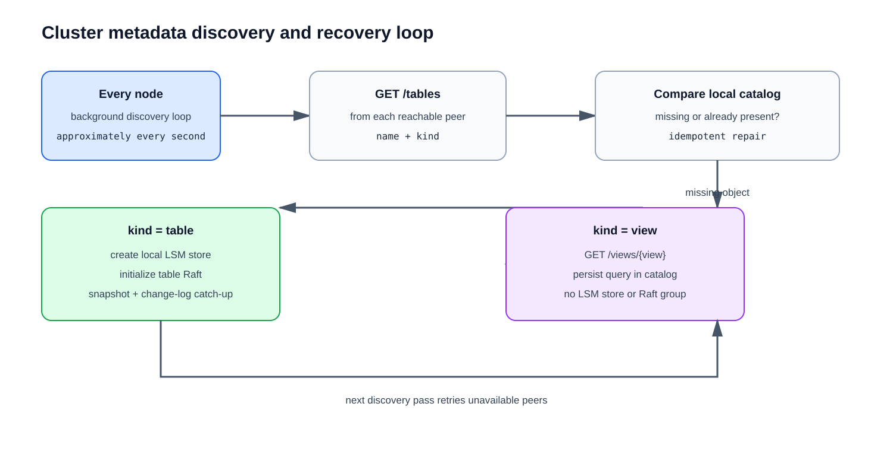

# Cluster Metadata Discovery and Recovery

## Purpose

Table and view creation is metadata management. The metadata is persisted in the
catalog of the node that accepts the request and propagated to configured peers
using direct HTTP. Because a peer can be unavailable or a request can fail, each
node also runs a background discovery loop to reconcile missing metadata after
startup and during normal operation.

The loop is implemented by `TableRaftReplicationService` and runs approximately
every second:

```text
peer /tables → compare metadata → repair local catalog
```

## Discovery flow



For every configured peer, a node requests `/tables`. The response includes the
object `name` and `kind`:

- `kind: "kv"`, `kind: "document"`, or `kind: "relational"`: the node creates the physical table if missing, initializes
  its per-table Raft node, and starts normal snapshot/change-log replication.
- `kind: "view"`: the node fetches `/views/{view}`, stores the view definition
  in its catalog, and does not create physical storage or a Raft group.

The operations are idempotent. If the object already exists locally, no
replacement is performed. If a request failed earlier, a later discovery pass
tries again when connectivity returns.

## Failure behavior

Assume a three-node cluster where A and B are available and C is temporarily
down during table creation:

1. A persists the table and sends peer propagation requests.
2. B receives the metadata; C misses the request.
3. A and B can still operate the table because they provide a Raft quorum.
4. C restarts and its discovery loop sees the table on A or B.
5. C creates its local store, initializes the table Raft node, and catches up
   from the leader using a snapshot followed by committed change events.

For a view, the same discovery step fetches the definition and writes it to
C's catalog. Views do not participate in Raft because they contain no rows.

If a majority of the table's Raft members are unavailable, writes cannot commit
until a quorum is restored. Metadata discovery repairs missing state, but it
does not replace Raft quorum requirements.

## Consistency and boundaries

- Creation acknowledgement is currently local plus leader-readiness based; it
  does not wait for every peer to acknowledge metadata.
- Direct HTTP propagation is the fast path. Discovery is the durable recovery
  path for transient failures and restarts.
- SSE is used for committed row change consumers and table replication; it is
  not used to distribute catalog definitions.
- A view definition is not materialized. Every view read evaluates its stored
  query against current base-table data.
- The current recovery loop discovers objects from reachable peers. If all peers
  are unreachable, repair waits until a later pass succeeds.

## Future improvements

Possible future enhancements include a quorum-acknowledged DDL protocol,
durable retry queues, catalog versioning, dependency-aware view recovery, and
explicit conflict handling for concurrent metadata changes.